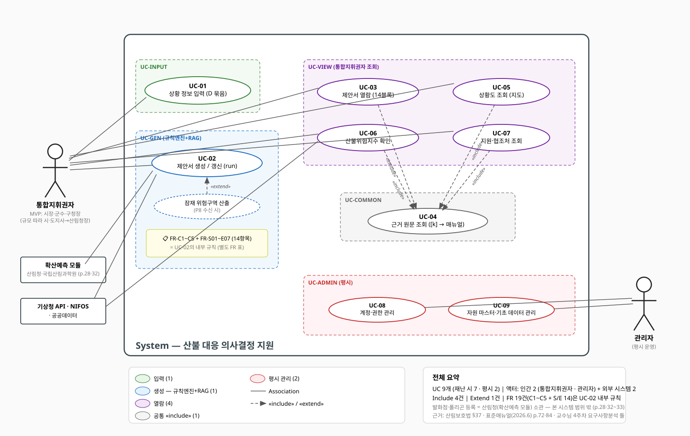
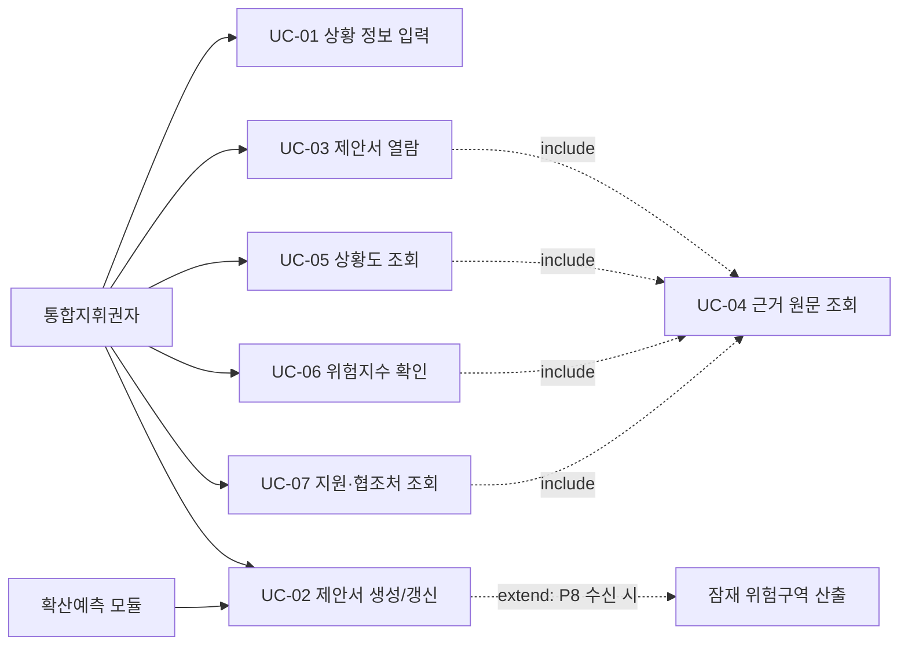
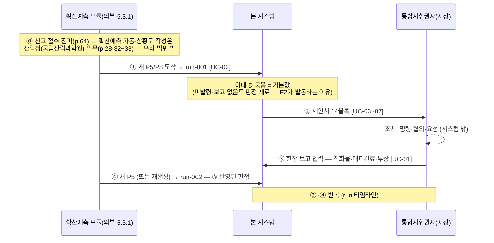

# 서비스 기능 정의 — 유스케이스·기능 요구 (교수님 PPT 틀 정렬판)

> 허브 [[00_4-2주차_INDEX]] · 형식 기준: **캡스톤_4주차_3_요구사항분석.pptx** (4.4 유스케이스 분석 과정 → 4.5 IEEE 830 명세 구조) · 전신 [[요구사항_유스케이스_초안]](4-1주차)
> 기준: 9/24 확정 스펙 + 화면 v1(`~/devel_sj/wfg/screen-draft/`) 동작
> **구조 원칙 (교수님 틀):** 유스케이스 = 액터와의 인터랙션 목표 단위 — **UC 9개 (재난 시 7 + 평시 2)** / 14개 제안 항목 = UC-02의 **기능 요구(FR)** 상세 — IEEE 830의 "2.2 기능 요구 = 기능 #n(사용 사례 #n)" 방식
> ※ QnA는 기능 목록에서 제외 (재도입 결정 시 UC 추가)

---

## 1. 액터 정의 (액터 찾기 4질문 적용)

| 액터                         | 구분                           | 도출 질문                                    | 설명                                                                                                                                                                                                                 |
| -------------------------- | ---------------------------- | ---------------------------------------- | ------------------------------------------------------------------------------------------------------------------------------------------------------------------------------------------------------------------ |
| **통합지휘권자** (현 시점의 지휘권 보유자) | **주 행위자 (단일 역할)**            | "주요 기능을 사용하는 그룹?" + "작업 수행을 위해 지원받는 그룹?" | 지휘권자는 규모에 따라 이동하는 **자리**: 중·소형=시장·군수·구청장 → 대형=시·도지사 → 둘 이상 시·도=산림청장(산림보호법 §37, p.72). **MVP 범위(초기대응~확산 1단계)에서는 시장·군수·구청장**(겸 주민대피 명령권자 p.84). 열람·판단·협의·요청 + 현장·상황 정보 입력 수행. 지휘권 인계 시점은 FR-S06이 판정(걸친 행정구역 수, p.72) |
| 확산예측 모듈 (5.3.1)            | 외부 시스템                       | "다른 외부 시스템과 동작?"                         | P5·P8·F0·슬라이스 공급 — UC-02의 트리거                                                                                                                                                                                      |
| 기상청 API · NIFOS · 공공데이터    | 외부 시스템                       | 〃                                        | 기상 시계열 · 산불위험지수 · 시설 좌표                                                                                                                                                                                            |
| **관리자** (지자체 시스템 운영 담당)    | 부 행위자 (평시) | "유지보수·관리 등 부수 기능을 사용하는 그룹?"              | 평시: 계정·권한 발급(지휘권자·본부 구성원·파견 연락관), **자원 마스터 DB 관리**(보유 헬기·차량·인력), 정적 레이어 갱신 (UC-08·09)                                                                                                    |
| ⚠ 산림청장·경찰·소방·한전·면사무소       | **액터 아님**                    | —                                        | 협의·요청의 "대상" — 시스템과 상호작용 없음, 출력 문구·지도 표시로만 등장                                                                                                                                                                       |

> ※ **액터 단일화 결정 (매뉴얼 근거 보강)**: 서비스 대상이 "개인 1인"(9/24 확정)이고, 입력이 최소셋으로 줄어 인간 액터는 **통합지휘권자 1명**으로 모델링한다. 매뉴얼상 이 액터의 실체는 **통합지휘본부(본부장=시장 + 참모반)** — 현장 상황 수집·보고는 **상황총괄반**의 임무(p.38·40~41)이나, 상황총괄반은 본부장의 참모(같은 조직 내 대리 수행)이지 독립 행위자가 아니므로 별도 액터로 두지 않는다.
> ※ **발화점·폴리곤 등록이 액터에 없는 이유 (매뉴얼 근거)**: 발화 신고는 119 등 다원 접수·전파(p.64), **확산예측시스템 가동·확산예측상황도 작성은 산림청(국립산림과학원)의 임무**(p.28·32~33), 지자체는 그 결과를 받아 대피명령(p.75·81). 즉 폴리곤 생산은 매뉴얼상 산림청 체계 = 우리 모델의 "확산예측 모듈(외부 시스템)"이며, 본 시스템 쪽 등록 UC는 불필요.

## 2. 유스케이스 식별자 목록 (9개)

| UC ID | 유스케이스명                   | 액터                        | 도출 질문(교수님 slide 26)                             |
| ----- | ------------------------ | ------------------------- | ----------------------------------------------- |
| UC-01 | 현장·상황 정보 입력 (D 묶음)       | 통합지휘권자                    | "액터가 시스템에 정보를 알리는 데 필요한 것은?"                    |
| UC-02 | 확산예측 수신 · 제안서 생성/갱신      | 확산예측 모듈(이벤트) / 통합지휘권자(수동) | "시스템이 어떤 작업을 수행하기를 원하는가?" + "정보를 알아내는 이벤트·빈도는?" |
| UC-03 | 의사결정 제안서 열람 (14블록·요약·필터) | 통합지휘권자                    | "액터가 원하는 정보는?"                                  |
| UC-04 | 근거 원문 조회 ([k] → 매뉴얼 청크)  | 통합지휘권자                    | 공통 동작 캡슐화 — **UC-03·05·06·07이 «include»**       |
| UC-05 | 상황도 조회 (지도 레이어·시설 상세)    | 통합지휘권자                    | "액터가 원하는 정보는?"                                  |
| UC-06 | 산불위험지수 확인 (1~100 + 근거)   | 통합지휘권자                    | 〃                                               |
| UC-07 | 지원·협조처 조회 (진화/대피 체계)     | 통합지휘권자                    | 〃                                               |

**운영 UC (평시):**

| UC ID | 유스케이스명 | 액터 | 비고 |
|---|---|---|---|
| UC-08 | 계정·권한 관리 | 관리자 | 지휘권자·본부 구성원·파견 연락관 계정 발급·승인, 인증(로그인) 운영 — §5의 3층 권한 모델 실행 |
| UC-09 | 자원 마스터·기초 데이터 관리 | 관리자 | 보유 자원 DB(헬기·차량·인력) 등록·갱신, 정적 레이어 관리 — UC-01 최소셋 #1의 공급원 |

**관계**: UC-03·05·06·07 —«include»→ UC-04 (근거 조회) / UC-02 —«extend»— "잠재 위험구역 산출" (P8 수신 조건 시) / (구 ID 대응: UC-01=C01, 02=C02, 04=C03, 05~07=C05~C07 · C04(QnA) 폐기)

**유스케이스 다이어그램 (발표·명세서용 정식판):**

## 2-1. 운영 사이클 — UC 번호는 식별자일 뿐, 실행은 순환이다

- **첫 run**: 입력할 현장 보고가 아직 없음 → D 묶음은 기본값으로 판정 참여 ("명령 미발령" → E2 즉시 제안, "부상 없음" → E7 (없음))
- **둘째 run부터**: UC-01 입력이 판정을 바꿈 (§4-3 추적표) — 이 순환이 `run_id`가 스키마에 있는 이유

---

## 3. 유스케이스 시나리오 (7개 폼)

> **왜 7개인가 — 분할 기준.** UC 1개 = 액터가 시스템 앞에서 이루려는 **목표 1개**(교수님 slide 21·26). 정보의 방향으로 나뉘고:
>
> | 방향 | 질문 | UC |
> |---|---|---|
> | 액터 → 시스템 (넣기) | "액터가 시스템에 알려야 할 것은?" | UC-01 |
> | 외부 → 시스템 (만들기) | "시스템이 수행하길 원하는 작업은?" | UC-02 |
> | 시스템 → 액터 (보기) | "액터가 원하는 정보는?" — 답의 종류가 4가지라 4개로 갈라짐: **무엇을** 해야 하나(03) / **어디가** 위험한가(05) / **얼마나** 위험한가(06) / **누가** 도와주나(07) | UC-03·05·06·07 |
> | 공통 동작 (떼어내기) | 중복 제거 «include» (slide 29) | UC-04 |
>
> **검증**: 더 쪼개면(14항목 각각) 액터가 개별 호출하지 않으니 "인터랙션 목표" 기준 위반 → FR로 내림. 더 합치면(03·05·06·07을 "조회" 하나로) 사전 조건·예외가 제각각이라 시나리오 폼이 성립 안 함. 즉 기준 = **"고유한 사전 조건·흐름·예외를 가지는 최소의 액터 목표 단위"**. 각 UC가 화면 v1의 독립 요소(패널·카드·팝오버)와 1:1인 것이 이 분할의 방증(§6).

### UC-01 — 현장·상황 정보 입력

| 필드       | 내용                                                                                                          |
| -------- | ----------------------------------------------------------------------------------------------------------- |
| 행위자      | 통합지휘권자 (실무상 상황실 보좌 인력이 대행 가능 — 동일 역할)                                                                          |
| 유스케이스 내용 | **ELMFIRE(확산예측)가 줄 수 없는 값만** 입력한다 — 사람의 행위(발령·지시)·현장 보고·내부 자원. 확산 관련 값(피해면적·화선)은 예측 폴리곤에서 자동 산출하므로 입력하지 않는다 |
| 사전 조건    | 산불 상황 개시, 화면 접속 상태                                                                                          |
| 기본 흐름    | 1. 상황 입력 패널 열기 → 2. 항목 수정 → 3. 시스템이 "재생성 필요" 상태 표시 → 4. 재생성(UC-02) 시 새 run에 반영                              |
| 예외 흐름    | E1. 필수 필드 결측 → 관련 항목 "정보 부족" 판정 (예: 예상 진화시간 미입력 → FR-S01 판정에 명기)                                            |
| 대안 흐름    | A1. 시나리오값 자동 주입(데모 모드)                                                                                      |
| 사후 조건    | 입력값이 다음 제안서 생성의 D 묶음 입력으로 사용됨 — **입력별 활용처는 §4-3 추적표**                                                       |

#### UC-01 입력 필드 최소셋 — 각각이 필요한 이유 (설계 원칙: 입력 최소주의)

> 심사 기준: **"ELMFIRE·기존 레이어·계산으로 대체 불가능한가?"** — 대체 가능하면 입력에서 뺀다.

| #   | 필드               | 유형                        | 왜 입력이어야 하나 (소비처)                                            |
| --- | ---------------- | ------------------------- | ----------------------------------------------------------- |
| 1   | 보유 자원 (헬기·인력·차량) | 🗄 자원 마스터 DB — 평시 지자체 등록·관리, **재난 중 조회 전용** (예외: "정비 중 1대" 차감 보정만) | S3 가용=보유DB−투입, S6 부족분 — 지자체 내부 정보, 어떤 모델도 모름 |
| 2   | 투입 현황 (헬기·인력)    | ✍️ 실시간                    | S3 배분·재배치의 현재값 — 지휘 집행 결과                                   |
| 3   | 진화율              | ✍️ 실시간 (선택)               | S3 구역별 재배치 기준(p.41) — 현장 무전으로만 파악. 미입력 시 재배치 제안 생략          |
| 4   | 예상 진화시간          | ✍️ 실시간 (선택)               | S1 판단기준 4요소 중 1(p.73) — 지휘관 판단값. 미입력 시 "미입력" 표기(SC-1a 동일)   |
| 5   | 미대피·부상 보고        | ✍️ 실시간                    | E3 미대피=명령 대상−완료(p.84), E7 구조 트리거 — 현장 확인 사항                 |
| 6   | 대피명령 상태          | 🔘 버튼 (E2 블록 "발령함")       | E2 중복 제안 방지·E3 활성화 — **시장 본인의 행위**라 별도 입력이 아니라 결정 순간에 원천 기록 |
| 7   | 재난문자 송출 단계       | 🔘 버튼 (E6 "송출 지시함")       | E6 중복 송출 방지(p.78~79) — 위와 동일 원리                             |
| 8   | 공식 대응단계          | 📨 외부 통보 (드롭다운, 산불당 1~2회) | S1 격상 트리거 = 권고 vs 공식의 격차(p.22) — 산림청장 발령 사실의 기록             |

**입력에서 제외한 것과 사유:**

| 제외 필드 | 사유 |
|---|---|
| ~~현재 피해면적~~ | F0(현재 화선·연소 폴리곤) 면적으로 **자동 추정** — "추정" 라벨 표시, 현장 보고 수신 시 대체 |
| ~~화선 길이~~ | F0 선형에서 **자동 계산** |
| ~~위기경보~~ | 전국 단위 발령이라 지역 판정에 실사용처 없음 — MVP 제외 (위험지수 카드 UC-06이 위험도 축 담당) |
| ~~인접기관 가용 자원~~ | 데이터 미확보(부록 B) — S6는 "부족 발생" 사실과 요청 대상까지만 제안, 규모 산정은 향후 과제 |
| ~~진화인력 위치~~ | 수기 입력 대상 아님 — 위치추적 시스템 연동(현재는 시나리오값), S7·E7 소비 |

→ 재난 중 실제 타이핑은 **✍️ 4개**(그중 2개 선택), 나머지는 버튼·드롭다운·평시 등록. 문제 1-2(시간 없음)와 충돌하지 않는 근거.

### UC-02 — 확산예측 수신 · 제안서 생성/갱신

| 필드       | 내용                                                                                                                                                       |
| -------- | -------------------------------------------------------------------------------------------------------------------------------------------------------- |
| 행위자      | 확산예측 모듈(새 P5 이벤트) / 통합지휘권자(수동 재생성) — ⚠ 방식 확정은 회의(가정 B)                                                                                                      |
| 유스케이스 내용 | P5(필수)·P8·F0·슬라이스 수신 시 규칙엔진(2차 정보 연산)+RAG로 제안서 JSON(items 14 고정)을 생성하고 run_id를 발급한다                                                                      |
| 사전 조건    | 확산예측 인터페이스 합의(P2 미결), 정적 레이어 적재, D 묶음 존재                                                                                                                 |
| 기본 흐름    | 1. 새 P5 수신(또는 재생성) → 2. 2차 정보 연산([[GIS연산_실현성]]) → 3. **FR-S01~FR-E07** 트리거 판정 → 4. 발동 항목 RAG 생성+근거 [k] → 5. JSON 출력(**FR-C1 출력 계약** 준수) → 6. run 타임라인 추가 |
| 예외 흐름    | E1. LLM 재시도 실패 → 블록 "생성 실패" / E2. 트리거 미발동 → "(없음)" 블록(생략 불가)                                                                                             |
| 대안 흐름    | A1. «extend» P8 수신 시 잠재 위험구역 산출 — 미수신이면 "산출 불가" 표시                                                                                                       |
| 사후 조건    | 새 run 제안서 표시, 이전 run 타임라인 보존                                                                                                                             |

### UC-03 — 의사결정 제안서 열람

| 필드 | 내용 |
|---|---|
| 행위자 | 통합지휘권자 |
| 유스케이스 내용 | 14개 항목 블록(S1~S7·E1~E7 순서 고정)과 요약을 열람하고, 구분 토큰(즉시·대기·협의·요청 등)으로 필터해 지금 할 일을 파악한다 |
| 사전 조건 | UC-02 완료(제안서 JSON 존재) |
| 기본 흐름 | 1. 헤더(t0·직위·공식/판정 단계) 확인 → 2. 14블록 열람(블록당 판정/구분/제안/대상/충돌/근거 6줄) → 3. 요약 바에서 토큰별 집계 확인 → 4. 토큰 칩 필터 → 5. 대상 칩 클릭 시 지도 연동(UC-05) |
| 예외 흐름 | E1. "근거 부족/정보 부족/생성 실패" 블록 → 상태 그대로 노출(숨기지 않음) |
| 대안 흐름 | A1. (없음) 블록은 접힌 상태로 표시 |
| 사후 조건 | 통합지휘권자가 항목별 조치(직접 시행·협의·요청)를 판단할 수 있는 상태 — «include» UC-04 |

### UC-04 — 근거 원문 조회 («include» 공통)

| 필드       | 내용                                                             |
| -------- | -------------------------------------------------------------- |
| 행위자      | 통합지휘권자                                                            |
| 유스케이스 내용 | 제안문 [k] 각주·근거 줄·위험지수 카드를 클릭해 표준매뉴얼 근거(쪽수·조항·청크ID)를 그 자리에서 확인한다 |
| 사전 조건    | 매뉴얼 청크 DB 적재(프로토타입)                                            |
| 기본 흐름    | 1. [k] 클릭 → 2. 클릭 위치 팝오버 → 3. 문서명·쪽수·조항·청크ID(+원문 발췌)           |
| 예외 흐름    | E1. 청크 미존재 → "근거 부족" 노출                                        |
| 대안 흐름    | (없음)                                                           |
| 사후 조건    | 제안의 매뉴얼 근거 확인 완료                                               |

### UC-05 — 상황도 조회

| 필드 | 내용 |
|---|---|
| 행위자 | 통합지휘권자 |
| 유스케이스 내용 | 연소구역(현재)→등시선(1·3h)→P5(5h)→P8(8h) 시간 진행과 마을·대피소·요청기관·보호대상 시설을 한 지도에서 보고, 시설 클릭으로 실명·주소·연락처를 확인한다 |
| 사전 조건 | UC-02 완료(폴리곤), 정적 레이어 적재 |
| 기본 흐름 | 1. 레이어 합성 표시 → 2. 레이어 토글 → 3. 시설 마커 클릭 → 상세 팝오버 → 4. 제안서 대상 칩 → 요소 점멸(UC-03 연동) |
| 예외 흐름 | E1. 레이어 미확보(행정리·한전 등 P2) → 비표시+명시 |
| 대안 흐름 | (없음) |
| 사후 조건 | 공간 상황 파악 완료 |

### UC-06 — 산불위험지수 확인

| 필드       | 내용                                                                                                        |
| -------- | --------------------------------------------------------------------------------------------------------- |
| 행위자      | 통합지휘권자                                                                                                       |
| 유스케이스 내용 | 산불위험지수(1~100, 매뉴얼 p.13~14)와 등급(위기경보 연동 51/66/86, p.49~50)을 지도 카드로 보고, 클릭해 산정 요인(습도·풍속·기온·임상·지형)과 출처를 확인한다 |
| 사전 조건    | NIFOS 지수 수신(산식 비공개 — 발표값 연동)                                                                              |
| 기본 흐름    | 1. 카드 상시 표시(지수+등급+구간 눈금) → 2. 클릭 → 요인·출처 팝오버                                                              |
| 예외 흐름    | E1. 지수 미수신 → "미산출(정보 부족)" (근거 없는 등급 표시 금지)                                                                |
| 대안 흐름    | (없음)                                                                                                      |
| 사후 조건    | 위험도와 근거 확인 — ⚠ 출력 계약 `risk` 필드 추가는 회의 결정([[시안_v1_가정과_계약불일치]] #6)                                          |

### UC-07 — 지원·협조처 조회

| 필드 | 내용 |
|---|---|
| 행위자 | 통합지휘권자 |
| 유스케이스 내용 | "어디서 도움을 받는가"를 진화(산림청·소방·경찰군·인접시군·한전)/대피(경찰·소방·자치행정·시설 소관기관·CBS) 체계로 보고, 대피 4갈래 거점(수송=면사무소·구조=119센터·통제=파출소·시설이송=취약시설)을 지도에서 확인한다 |
| 사전 조건 | 기관·연락처 데이터 적재 |
| 기본 흐름 | 1. 패널 열기 → 2. 기관별 임무·관련 FR 태그·근거 쪽수·연락처 → 3. 지도 거점 링으로 최근접 요청처 확인 |
| 예외 흐름 | E1. 연락처 미확보 → "확인 필요" |
| 대안 흐름 | A1. (프로토타입) FR 태그 클릭 → 해당 블록 이동 |
| 사후 조건 | 요청 실행 창구 확인 완료 |

---

## 4. 기능 요구 (FR) — "시스템은 ~해야 한다"

> IEEE 830 §2.2 방식: 기능 요구는 UC와 1:1로 묶이고, **UC-02(제안서 생성)의 상세가 FR-S/E 14건 + 출력 계약 FR-C**다.
> ⚠ 트리거 조건은 SC-1a 역산 예시 — 정식 트리거 조건표는 P2 미결

### 4-0. 출력 계약 준수 (UC-02 공통)

- **FR-C1**: 시스템은 제안서를 헤더 1 + 블록 14(S1~S7·E1~E7 순서 고정, 생략 불가) + 요약 1로 생성해야 한다. 블록당 판정/구분/제안/대상/충돌/근거 6줄 고정
- **FR-C2**: 구분 토큰은 9종 고정 어휘만 사용해야 한다 (즉시·대기·협의·요청·보고·근거 부족·정보 부족·생성 실패·(없음))
- **FR-C3**: 판정 줄은 규칙엔진 산출값만 사용해야 한다 (LLM 재계산 금지)
- **FR-C4**: 모든 제안 문장은 매뉴얼 근거 [k]를 가져야 하며, 근거가 없으면 해당 내용을 생성하지 않고 상태로 표기해야 한다 (근거 부족/정보 부족/생성 실패)
- **FR-C5**: 최종 출력은 JSON 스키마(items 길이 14, `run_id` 포함)를 따라야 한다

### 4-1. 진화 제안 (FR-S01~S07)

#### FR-S01 — 대응단계 격상 검토안
| 필드     | 내용                                                                        |
| ------ | ------------------------------------------------------------------------- |
| 트리거(예) | 매 run (4요소 시점마다 변동)                                                       |
| 판정 로직  | 예상 피해면적=면적(P5), 시설피해 동수=주택·시설∩P5, 평균풍속, 예상 진화시간(입력) → 4요소 규칙 권고 단계 (p.73) |
| 제안·대상  | 권고>공식 시 산림청장과 격상 협의 — 구분 **협의** (p.22·91)                                 |
| 특이 예외  | 예상 진화시간 미입력 → 판정 줄 "미입력" 명기                                               |

#### FR-S02 — 진화 우선지역·보호대상 순서
| 필드 | 내용 |
|---|---|
| 트리거(예) | 보호대상 ∩ P5 ≥ 1 |
| 판정 로직 | 등급별 목록(①인명 ②기간산업·군사·국가유산 ③재산 ④중요 산림 ⑤기타, p.77) + F0 거리 순위 |
| 제안·대상 | 우선지역 순서 — 구분 **즉시** (지도: 마을·산단·송전선·주택군) |
| 특이 예외 | (공통만) |

#### FR-S03 — 진화자원 투입·배분·재배치안
| 필드 | 내용 |
|---|---|
| 트리거(예) | 매 run (구역별 진화율·확산 정도 변동, p.41·78) |
| 판정 로직 | 진화구역 분할(방위·읍면동) → 구역 우선순위(보호대상·면적·난도) → 자원 부족분(보유−투입) |
| 제안·대상 | 우선 구역 배치 — 구분 **즉시**. **수량 산식 없음 → 순서까지만, 수량은 "근거 부족"** |
| 특이 예외 | 진화 난도 근거 없음(P3 — 산림과학원 연구자료 1208호 검토 대상) |

#### FR-S04 — 진화 방식·시간대 전략
| 필드 | 내용 |
|---|---|
| 트리거(예) | 기상 변화·일출입 경계 시점 |
| 판정 로직 | 헬기 운용 가능(풍속·시정·야간 — 임계 미정 P3), 풍속 완화 시간대, 야간 구간(t0+5h vs 일몰) (p.78) |
| 제안·대상 | 지상 집중/헬기 재투입/일출 전 집중 — 구분 **즉시** |
| 특이 예외 | 헬기 임계값 미확보 → "임계 미정" 명기 |

#### FR-S05 — 시설 보호 조치
| 필드 | 내용 |
|---|---|
| 트리거(예) | 시설(주택·국가유산·송전선·산단) ∩ P5 ≥ 1 |
| 판정 로직 | 보호 대상 목록 + 접근 경로 유무 + 조치 유형 매핑 (p.79·95) |
| 제안·대상 | 소방 배치(**즉시**) + 한전 전류 차단(**요청**) |
| 특이 예외 | (공통만) |

#### FR-S06 — 유관기관 동원·협조 요청안
| 필드 | 내용 |
|---|---|
| 트리거(예) | 자원 부족분 > 0 또는 걸친 시·군·구 ≥ 2 |
| 판정 로직 | 걸친 행정구역 수→지휘권 변경(p.72), 부족 자원 × 유관기관 기능표(p.119) |
| 제안·대상 | "어느 기관에 무엇을" — **직접(동원)/요청** (UC-07 연동) |
| 특이 예외 | 부족분 산출 불가(소요 기준 없음) → "(없음)" |

#### FR-S07 — 진화인력 안전·투입 관리 경보
| 필드 | 내용 |
|---|---|
| 트리거(예) | 인력 ∩ P5 ≥ 1 또는 풍향 급변 |
| 판정 로직 | 위험 인력 목록, 퇴로 유무, 풍향 급변, 인명피해 위험 (p.77·118) |
| 제안·대상 | 위치추적·퇴로 확인/철수 — 구분 **즉시** |
| 특이 예외 | 인력 위치 미수신 → "정보 부족" |

### 4-2. 대피 제안 (FR-E01~E07)

#### FR-E01 — 위험구역(P5/P8) 마을 목록
| 필드 | 내용 |
|---|---|
| 트리거(예) | 마을 ∩ P5 ≥ 1 (또는 P8) |
| 판정 로직 | 위험구역=마을∩P5(즉시 실행), 잠재=마을∩(P8−P5)(실행 대기) (p.74~76) |
| 제안·대상 | 구역 설정 — 구분 **즉시/대기** (지도 하이라이트) |
| 특이 예외 | **P8 없음 → "산출 불가" 표시** |

#### FR-E02 — 대피명령 대상·순서·시점
| 필드 | 내용 |
|---|---|
| 트리거(예) | FR-E01 발동 시 |
| 판정 로직 | 마을 순위(도달시간·F0 거리, 취약계층 우선 p.79), 야간 포함(p.75), 시점(즉시·대기·사전) |
| 제안·대상 | 마을 단위 명령(p.76·84) — **즉시/대기**. 실행은 자치행정 수송·1:1 담당제(UC-07) |
| 특이 예외 | 인구·취약 속성 미확보(P2) → 순위 근거 축소 명기 |

#### FR-E03 — 취약시설·미대피 주민 조치
| 필드 | 내용 |
|---|---|
| 트리거(예) | 취약시설 ∩ (P5∪P8) ≥ 1 또는 미대피 보고 |
| 판정 로직 | 이송 대상 시설·인원(p.75), 미대피=명령 대상−완료 보고(p.84) |
| 제안·대상 | 시설별 이송(소관기관, p.94)·강제 대피 — **즉시** |
| 특이 예외 | SC-1a: 해당 없음 → "(없음)" |

#### FR-E04 — 대피소 배정·분산안
| 필드 | 내용 |
|---|---|
| 트리거(예) | FR-E02 발동 시 |
| 판정 로직 | 안전 대피소=대피소−(P5∪P8), 최근접·이동시간(도로 최단경로), 초과 분산 (p.65) |
| 제안·대상 | 마을→대피소 배정 — **즉시** (지도: 옥계초·면사무소) |
| 특이 예외 | 다음 run에서 배정 대피소가 P8 포함 → 충돌 처리(충돌 유형표 P2) |

#### FR-E05 — 대피 경로·교통통제 요청안
| 필드 | 내용 |
|---|---|
| 트리거(예) | 경로 ∩ P5 ≥ 1 또는 대피로∩진입로 겹침 |
| 판정 로직 | 위험 구간, 충돌 구간(소방서→F0 경로), 통제 지점 (p.65·119) |
| 제안·대상 | 경찰 교통통제 — **요청** (지도: 옥계파출소). 충돌 줄 기록(관련 S3/처리: 요청 전환) |
| 특이 예외 | (공통만) |

#### FR-E06 — 전파(재난문자·방송) 송출안
| 필드 | 내용 |
|---|---|
| 트리거(예) | 대피 상태 변경(발생·권고·명령) |
| 판정 로직 | 대상 읍면동=읍면동∩(P5∪P8), 송출 단계, 생략 가능 여부 (p.78~79) |
| 제안·대상 | 단계별 CBS·자막방송 — **즉시** |
| 특이 예외 | 송출 이력 중복 → 단계 갱신만 |

#### FR-E07 — 인명구조·긴급구조 요청안
| 필드 | 내용 |
|---|---|
| 트리거(예) | 고립 후보 ≥ 1 또는 부상·미대피 보고 |
| 판정 로직 | 고립 후보=(마을·인력∩P5) 중 탈출 도로 전부 잘림, 접근 곤란 구역 (p.119) |
| 제안·대상 | 소방(긴급구조통제단) 요청 — **요청** (지도: 119안전센터) |
| 특이 예외 | SC-1a: 해당 없음 → "(없음)" |

---

### 4-3. 입력(D 묶음) → 판정 추적표 (UC-01이 없으면 무엇이 죽는가)

> 시스템 등식: **확산예측(미래 어디까지) + 정적 레이어(거기 뭐가 있나) + D 묶음(지금 어디까지 했나) → 매뉴얼 규칙 적용 → "지금 무엇을 하십시오"**
> D 묶음은 "지금 어디까지 했나" 축 — 이게 있어야 매뉴얼 일반론이 아니라 **이 시각·이 상황의 제안**이 된다. 미입력 시 아래 FR들이 "정보 부족"으로 전락 (14블록 중 절반).

| UC-01 입력값 (최소셋 8) | 소비하는 FR | 판정에서의 역할 | SC-1a 실례 |
|---|---|---|---|
| 예상 진화시간 (선택) | FR-S01 | 판단기준 4요소(p.73) 중 1 | S1 판정 "예상 진화시간 **미입력**" |
| 공식 대응단계 (외부 통보) | FR-S01, S06 | 규칙 판정과 **비교** → 격상 협의 트리거 | 헤더 "공식 초기대응 vs 규칙 판정 1단계" |
| 보유(사전 등록)·투입 자원 | FR-S03, S06 | 가용=보유−투입, 부족분>0 → 동원 요청 | S3 판정 "투입 헬기 2대 / 가용 3대" |
| 진화율 (선택) | FR-S03 | 구역별 진화율 기반 재배치(p.41) | run 갱신 시 구역 순위 변동 |
| 대피명령 상태 (🔘 E2 버튼) | FR-E02, E03 | "미발령"일 때만 "즉시 명령" 제안 (중복 방지) | E2 판정 "명령 미발령" |
| 미대피·부상 보고 | FR-E03, E07 | 미대피=명령 대상−완료 / 구조 요청 트리거 | E3·E7 "보고 없음" → (없음) |
| 재난문자 송출 단계 (🔘 E6 버튼) | FR-E06 | 송출 단계 판정·중복 송출 방지 | E6 판정 "송출 이력 없음" |

*자동 산출로 입력에서 제외: 현재 피해면적·화선 길이(F0에서 계산, FR-S01·S03) · 진화인력 위치(위치추적 연동, FR-S07·E07) — 상세는 UC-01 최소셋 표*

## 5. IEEE 830 명세서 매핑 (교수님 slide 31 구조 → 우리 내용)

| 명세서 장 | 우리 내용 |
|---|---|
| 1. 개요 (목적·범위·정의) | 목적=지자체장(1인) 산불 의사결정 지원 / 정의=P5·P8·F0·위험지수(1~100)·구분 토큰 9종 |
| 2.1 외부 인터페이스 | 확산예측 모듈(P5 — 합의 필요 P2) · 기상청 API · NIFOS · 공공데이터(대피소·시설) |
| 2.2 기능 요구 | **UC-01~07과 1:1** — UC-02 상세 = FR-C1~C5 + FR-S01~E07 (본 문서 §3·§4) |
| 3.1 성능 요구 | 제안서 생성 시간 상한 — **수치 미정, '미결(결정 예정)' 명기** (P3) |
| 3.3 예외 조건·처리 | 근거 부족/정보 부족/생성 실패 상태, 근거 없으면 보류 (FR-C4 = 교수님 안전 규칙) |
| 3.2 보안·접근통제 | **3층 권한**: 조작(통합지휘본부 — 발령 버튼·상황 입력·재생성) / 열람(본부 구성원 + 파견 인원: 산림청 공동 보좌관 p.82·유관기관 연락관·한전 협력관 p.95 — 소속 기관 무관, 다음 지휘권자 후보 포함) / 그 외 차단(민감 레이어: 송전선·취약계층). 인증·계정 관리는 UC-08(관리자) 소관 — 내부망(재난안전통신망 PS-LTE, p.82) 배치 전제 |
| 3.4 자원·제약 | LLM·인프라(A6000급 한계, 미정 P3) · NIFOS 산식 비공개 · 미확보 데이터(행정리·한전·P8 인터페이스) |
| 4. 인수 조건 | 시나리오별 기대 출력 대조(SC-1a → sc-1a.json이 기대 출력물), 근거 인용 정확도 — 방식 미정(P3)이나 **장은 필수** |
| 5. 참고 자료 | 표준매뉴얼(2026.6) · 회의록(4-2차) · NIFOS |

## 6. 화면 v1 ↔ UC/FR 검증표

| 화면 요소 | 대응 |
|---|---|
| 상황 입력 플로팅 패널 | UC-01 |
| run 타임라인 · 새 P5 수신 · 재생성 | UC-02 |
| 제안서 14블록·6줄·토큰 배지·요약·필터 | UC-03 (내용 = FR-C·FR-S/E) |
| 근거 [k]·위험지수 카드 → 팝오버 | UC-04 |
| 지도(레이어·시설 팝오버·대상 칩 점멸) | UC-05 |
| 위험지수 카드 | UC-06 |
| 지원·협조처 패널 + 대피 4갈래 거점 링 | UC-07 |
| ~~QnA~~ | — 기능·화면 모두에서 제거 완료 |

## 7. 다음 단계

- 21:00 회의: UC-02 생성·갱신 방식(가정 B) 확정 + QnA 제외 합의 확인 → 본 문서가 명세서 2.2(기능 요구)·4.3(시나리오)의 원고
- 트리거 조건표·충돌 유형표(P2) 확정 시 §4 "트리거(예)"를 정식 조건으로 교체
- NFR·제약(§5의 3장)과 인수 조건(4장)은 명세서 분담 시 별도 문서로 상세화
