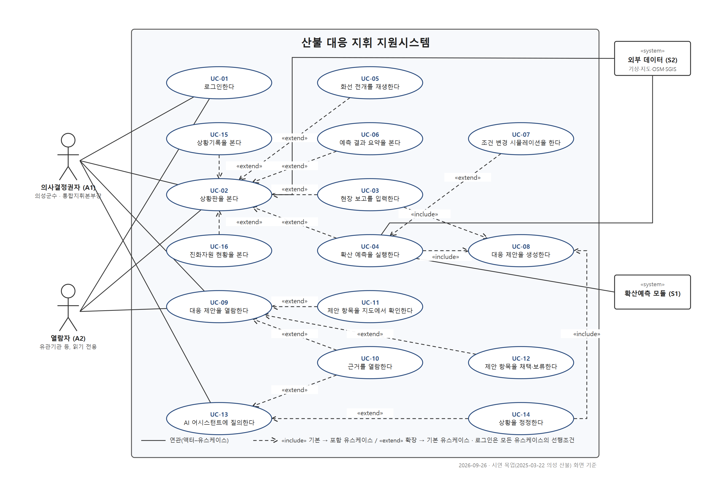

# 산불 대응 지휘 지원시스템

- 실행: https://evan-cloud4453.github.io/wildfire-mockup/
- 대상: 정적 웹 목업(`index.html`, `app.js`, `data*.js`). 확산 예측 결과를 표준매뉴얼 근거와 연결해 산불현장 통합지휘본부장에게 진화·대피 조치를 제안하는 의사결정 지원 화면.
- 시연 시나리오: 2025-03-22 경북 의성군 안평면 괴산리 산불, 기준시각 12:00, 발생 후 8시간(1시간 간격 P1~P8).
- 표기: 기능 ID는 `F<군>-<번호>`, 유스케이스 ID는 `UC-<번호>`. 각 기능의 **상태** 열은 목업에서 실제로 계산·동작하면 「동작」, 미리 정한 값·대본으로 흉내내면 「연출」, 실서비스에서 다른 구성요소로 바뀔 것이면 괄호에 적음.

---

## 1. 시스템 정의와 사용자

### 1.1 정의

실시간 모니터링 중인 산불에 특정 상황(발생, 확산, 기상 변화, 현장 보고 갱신)이 생기면 ① 확산 양상을 1시간 단위로 예측·렌더링하고, ② 예측 결과와 현장 입력을 규칙으로 판정해 의사결정권자가 지금 해야 할 대응 항목을 진화·대피로 나누어 근거와 함께 제안하며, ③ AI 어시스턴트로 제안 내용을 질의하거나 상황 변화를 정정하면 제안을 다시 생성하는 웹 시스템.

### 1.2 액터

| ID | 액터 | 종류 | 설명 | 사용 범위 |
|---|---|---|---|---|
| A1 | 의사결정권자 | 사람(주 액터) | 초기대응·확산대응 1단계의 시장·군수·구청장. 산불현장 통합지휘본부장 겸 주민대피 명령권자(표준매뉴얼 p.72, p.84). 시연에서는 의성군수 | 모든 기능. 현장 보고 입력·채택·AI 어시스턴트는 A1만 |
| A2 | 열람자 | 사람 | 유관기관·상급 본부 등. 읽기 전용 | 상황판·예측·제안 열람. 예측 실행 버튼·입력·채택·AI 어시스턴트 숨김 |
| S1 | 확산예측 모듈 | 시스템 | 발화점·기상·지형으로 1시간 슬라이스 P1~P8과 화선 산출(목업은 합성 타원 모델, 실서비스는 ELMFIRE) | UC-04, UC-07 |
| S2 | 외부 데이터 | 시스템 | 기상(목업은 고정값), 위성영상·지도 타일, OSM 마을·시설·도로·저수지, SGIS 경계 | UC-02, UC-04 |

### 1.3 화면 구성

| 영역 | 내용 | 기능군 |
|---|---|---|
| 상단 1줄 | 정부 상징·산림청·시스템명, 알림 토글, 진화자원 창 토글, 마을·시설 검색, 빨간 메뉴(산불현황·확산예측·대응제안·상황기록), 사용자·로그아웃 | F1, F2 |
| 상단 2줄 | 관할 경로(경상북도 › 의성군 › 안평면 · 기관), 파란 레이어 버튼 14개 | F2, F3 |
| 지도 | 위성영상(Esri) + 지명·도로 라벨(OpenFreeMap), 화선·위험구역, 아이콘 마커, 노란 거리 라벨, 우측 도구줄(확대·축소·범위 맞춤·위성/일반·3D), 세로 탭(산불·기상·범례), 우측 하단 나침반·좌표 | F2, F3 |
| 상황정보 창(우측, 이동 가능) | 헤더(날짜·시각·일출·일몰), 주소·신고·연락처·단계·지휘·기상 표, 탭 3개(상황정보·확산예측·대응제안) | F2, F3, F4 |
| 떠 있는 창 | 진화자원 현황(좌), 기상정보·범례(우), AI 어시스턴트 팝업(우측 하단 버튼), 상황기록 도크(하단), 모달(현장 보고·정정 확인·전후 비교·연락처·출처) | F2, F4, F5 |

---

## 2. 주요 기능

### 2.1 F1 로그인·개인화

| ID | 기능명 | 설명 | 화면 위치 | 상태 |
|---|---|---|---|---|
| F1-1 | 로그인·로그아웃 | 아이디·비밀번호·사용자 구분(의사결정권자/열람자)을 입력해 진입. 로그아웃하면 로그인 화면으로 복귀 | 로그인 화면, 상단 우측 | 연출(계정 검증 없음. 실서비스는 인증 서버) |
| F1-2 | 직위·관할 프로필 | 의사결정권자는 「의성군수 · 산불현장 통합지휘본부장」으로 표시되고 관할(경상북도 › 의성군 › 안평면)이 상단 2줄에 고정 | 상단 1·2줄, 상황정보 창 지휘 칸 | 연출(시나리오 고정값) |
| F1-3 | 관할 기반 초기 화면 | 로그인 직후 지도가 의성군 북부(발화점 일대)에 맞춰지고 상황정보 창이 열림 | 지도 | 동작 |
| F1-4 | 권한별 제한 | 열람자는 예측 실행·조건 변경·현장 보고·채택·AI 어시스턴트가 숨겨지고, 열람자 로그인 시 예측과 제안이 자동 생성되어 읽기만 가능 | 전체 | 동작 |

### 2.2 F2 상황판·지도

| ID | 기능명 | 설명 | 화면 위치 | 상태 |
|---|---|---|---|---|
| F2-1 | 지도 표시·조작 | 위성영상 위에 지명·도로 라벨을 겹친 지도. 드래그·휠·확대축소 슬라이더·범위 맞춤·북쪽 맞춤(나침반 클릭)·위성/일반지도 전환 | 지도, 우측 도구줄 | 동작 |
| F2-2 | 상황정보 헤더 | 표시 시각(재생 시각과 연동)·일출·일몰, 주소, 신고 경로·원인, 연락처, 공식 단계·위기경보와 규칙 판정 단계, 지휘권자, 풍향·풍속 | 상황정보 창 상단 | 동작(시각·판정) / 연출(연락처·신고 문구) |
| F2-3 | 상황접수·판정 표 | 접수 기관·시각, 공식 단계, 규칙 판정(격상 검토 배지), 5h·8h 예상 면적, 위험구역 마을 수, 즉시 조치 수, 현장 보고 값 | 상황정보 탭 | 동작(판정·면적) / 연출(접수 시각) |
| F2-4 | 근접 시설 표·거리 라벨 | 문화재·사찰, 대피소, 취약시설, 감시·진화대, 마을, 담수지별로 발화점에서 가장 가까운 시설과 거리(km). 체크하면 지도의 해당 시설에 노란 거리 라벨 표시. 반경 선택은 표시용 | 상황정보 탭 | 동작(거리 계산) |
| F2-5 | 레이어 버튼 | 화선·위험구역·마을·주택·취약시설·국가유산·대피소·담수지·송전탑·도로·철도·대피로·진화대·읍면경계·거리표시를 켜고 끔 | 상단 2줄 | 동작 |
| F2-6 | 마을·시설 아이콘·팝업 | 집(마을)·십자 건물(대피소)·병상(취약시설)·전각(국가유산·사찰)·사람(진화조)·물방울(담수지)·불꽃(발화점) 아이콘. 화선이 닿은 마을은 빨간색, 8시간 범위 안 대피소는 빨간 아이콘. 클릭하면 인구·도달 예상·배정 대피소 등 팝업 | 지도 | 동작 |
| F2-7 | 진화자원 현황 창 | 헬기·진화조·소방차의 호출부호·소속·구분·상태 표(투입 초록, 대기 노랑), 투입·대기 집계, 풍속 시계열 그래프, 지상인력·헬기 운용 가능 여부·진화율 | 상단 「진화자원」 토글, 좌측 창 | 연출(자원 수·호출부호 가상) |
| F2-8 | 기상정보 창 | 풍향·풍속·습도·시정·특보·일출일몰·야간 진입까지 시간, 풍속·습도 시계열 막대 | 세로 탭 「기상」 | 연출(시계열 가상. 실서비스는 기상청 API) |
| F2-9 | 범례 창 | 확산 범위·위험구역·아이콘·선형 범례, 데이터 출처 링크 | 세로 탭 「범례」 | 동작 |
| F2-10 | 상황기록 도크 | 시스템 이벤트(로그인·예측·제안 생성·결정·정정·현장 보고)와 실제 경과(보도 기준)를 시각순 표로 표시. 실제경과 표시·시스템 이벤트만 전환. 도크가 열리면 상단 「상황기록」 메뉴가 켜짐 | 상단 「상황기록」, 하단 도크 | 동작 |
| F2-11 | 담당자 연락처 | 통합지휘본부·산림과·남부지방산림청·소방·경찰·한전·경북도 상황실 연락처 표 | 상황정보 탭 버튼 → 모달 | 연출(번호 가상) |
| F2-12 | 검색 | 마을·대피소·시설 이름으로 찾아 지도 이동·강조·팝업 | 상단 검색창 | 동작 |
| F2-13 | 알림 토글 | 예측 갱신·제안 생성·결정·정정 이벤트를 화면 하단 알림으로 띄움. 끄면 기록만 남김 | 상단 「알림」 | 동작 |
| F2-14 | 현장 보고 입력 | 피해면적·화선 길이·진화율·예상 진화시간·자원 수·공식 단계·위기경보·대피명령·재난문자 이력·대피 완료 마을·부상 보고를 입력하면 상황이 갱신되고 제안이 재생성됨. 진화율 범위 등 검증 | 대응제안 탭 「현장 보고 입력」 → 모달 | 동작 |

### 2.3 F3 확산 예측·렌더링

| ID | 기능명 | 설명 | 화면 위치 | 상태 |
|---|---|---|---|---|
| F3-1 | 확산 예측 실행 | 발화점·기준시각·기상으로 1시간 간격 누적 화선 P1~P8 산출. 진행 단계(입력 검증→기상 조회→모델 실행→검증→판정·제안)를 표시하고 완료 후 5h·8h 면적과 주 확산 방향 표시 | 확산예측 탭 「확산 예측 실행」 | 연출(합성 타원 모델. 실서비스는 ELMFIRE) |
| F3-2 | 시간대별 재생 | 재생·정지·슬라이더·속도(1×·2×·4×)로 t0~+8h 화선 전개. 지나간 시각은 채움, 다음 1시간은 점선 윤곽. 표시 시각이 상황정보 헤더 시계와 연동되고 야간이면 표시 | 확산예측 탭 재생줄 | 동작 |
| F3-3 | 마을별 도달 예상 표 | 마을별 도달 시각, 위험구역(5h 이내)·잠재(8h 이내)·밖, 인구/고령, 배정 대피소와 이동 시간. 행 클릭 시 지도 이동 | 확산예측 탭 | 동작 |
| F3-4 | 예측 요약 KPI | 5h 예상 면적, 위험구역·잠재 마을 수, 즉시 조치 수, 일몰까지 남은 시간 | 확산예측 탭 상단 | 동작 |
| F3-5 | 조건 변경 시뮬레이션 | 풍속·풍향을 바꿔 재예측하고 기본 예측과 점선으로 겹쳐 비교. 기본 예측과 제안은 유지, 「기본으로」 복귀 | 확산예측 탭 「조건 변경」 | 동작(같은 합성 모델) |
| F3-6 | 3D 지형·건물 | 지형 기복(AWS 지형 타일) 위에 위성영상을 씌우고 OpenStreetMap 건물 외곽선 기반 3D 건물을 표시. 켜면 확대·기울임 | 우측 도구줄 「3D」 | 동작(건물 정보는 OSM 등록분만) |
| F3-7 | 화선·위험구역 레이어 | 현재 시각까지 확산 범위(붉은 채움), 이전 시각 윤곽선, 위험구역(5h)·잠재(8h) 채움과 경계선 | 지도 | 동작 |

### 2.4 F4 대응 제안

| ID | 기능명 | 설명 | 화면 위치 | 상태 |
|---|---|---|---|---|
| F4-1 | 제안 생성 트리거 | 예측 완료, 현장 보고 저장, 상황 정정 확인, 「제안 다시 생성」 버튼에서 생성. 매번 새 판(1판, 2판…)이 생기고 이전 판과 바뀐 항목에 「변경」 표시 | 대응제안 탭 | 동작 |
| F4-2 | 규칙 판정 | 예상 피해면적과 대응단계 기준, 마을별 도달 슬라이스·야간 여부, 취약시설·국가유산·송전선 포함 여부, 주택 수, 안전 대피소·수용 인원 배정·초과, 대피로·진입로 겹침 구간 도달 시각, 진화인력 위치, 걸친 행정구역·지휘권 변경 여부, 헬기 운용 가능 여부, 재난문자 대상 읍면 | 내부 | 동작 |
| F4-3 | 결정 항목(카탈로그) | 진화 7항목(대응단계 판단·격상 검토, 진화 우선지역·보호대상 선정, 진화자원 투입·배분·재배치, 진화 방식·시간대 전략, 시설 보호 조치, 유관기관 동원·협조 요청, 진화인력 안전·투입 관리)과 대피 7항목(위험구역 설정, 대피 명령 대상·순서·시점, 취약시설·미대피 주민 조치, 대피소 배정·분산, 대피 경로·교통통제, 전파(재난문자·방송), 인명구조·긴급구조 요청). 각 항목에 권한(직접·협의·요청)과 표준매뉴얼 쪽수 | 대응제안 탭 | 동작(항목 번호는 화면에 표시하지 않음) |
| F4-4 | 제안 문장 생성 | 판정 값을 하십시오체 문장으로 만들고 문장 끝에 근거 번호를 붙임. 매뉴얼에 근거가 없는 수량(추가 헬기 대수 등)은 「근거 부족」으로 표기 | 대응제안 탭 | 연출(템플릿. 실서비스는 EXAONE + RAG) |
| F4-5 | 막대 목록·구분 배지 | 항목이 막대 한 줄(항목명 + 즉시·대기·협의·요청·근거 부족 배지, 결정 표시)로 나열되고 진화/대피 탭과 구분 필터로 좁힘. 해당 없는 항목은 「해당 없음 N건 보기」 뒤에 접힘 | 대응제안 탭 | 동작 |
| F4-6 | 항목 상세 | 막대를 누르면 제안 문장, 판정 값, 대상, 충돌(예: 대피로·진입로 겹침 → 요청 전환), 근거 목록, 권한, 지도·질문·채택·보류·수정 지시 버튼 | 대응제안 탭 | 동작 |
| F4-7 | 근거 열람 | 문장 속 번호나 근거 목록을 누르면 근거 창이 열려 해당 문장과 표준매뉴얼 쪽·절·요약 청크를 표시 | 대응제안 탭 → 근거 창 | 동작(청크는 쪽수 기준 요약) |
| F4-8 | 제안↔지도 연동 | 막대에 마우스를 올리면 대상 마을·대피소·시설·경로가 지도에서 강조되고, 「지도」 버튼으로 이동. 마을 팝업의 「대피 제안 보기」로 역방향 이동 | 대응제안 탭, 지도 | 동작 |
| F4-9 | 격상 검토 권고 | 규칙 판정 단계가 공식 단계보다 높으면 제안 상단에 격상 검토 권고와 격상 시 지휘권자·인계 항목을 표시. 시스템은 직위를 바꾸지 않음 | 대응제안 탭 상단, 상황정보 헤더 | 동작 |
| F4-10 | 채택·보류·수정 지시 | 항목별로 결정을 표시·해제하면 막대 배지와 요약, 상황기록에 반영. 브라우저에 저장되어 새로고침해도 유지. 이전 판에는 기록 불가 | 항목 상세 | 동작 |
| F4-11 | 판 이력·전후 비교 | 판 선택 상자로 이전 판 열람(「이전 판」 표시). 재생성 시 바뀐 항목만 이전·이후 문장으로 비교 창 표시 | 대응제안 탭 상단, 모달 | 동작 |
| F4-12 | 상태 표시 | 근거 부족·정보 부족·해당 없음을 배지로 드러냄. 공식 단계가 2단계 이상이면 범위 밖 안내 | 대응제안 탭 | 동작 |

### 2.5 F5 AI 어시스턴트

| ID | 기능명 | 설명 | 화면 위치 | 상태 |
|---|---|---|---|---|
| F5-1 | 팝업·항목 컨텍스트 | 우측 하단 「AI 어시스턴트」 버튼으로 떠 있는 대화 창을 열고, 항목의 「질문」으로 열면 그 항목의 제안·근거·상황값이 컨텍스트로 붙음. 창은 헤더를 잡고 이동 | 우측 하단 버튼, 팝업 | 동작 |
| F5-2 | 질의 응답 | 대피 순서·대피소 수용·헬기 대수·격상 기준·야간·송전선·재난문자·교통통제·취약시설·근거·데이터 구분 질문에 상황값을 넣어 답하고 근거 번호를 붙임. 근거가 없으면 「근거 부족」 | 팝업 | 연출(키워드 대본. 실서비스는 EXAONE + RAG) |
| F5-3 | 상황 정정 | 「박곡리 대피 완료」「헬기 6대 투입」「대피명령 발령」「확산대응 1단계 발령」 같은 발화를 상황 변경안으로 바꿔 확인 창에 보이고, 확인하면 저장·기록 후 제안을 재생성하고 전후 비교를 띄움 | 팝업 → 확인 모달 | 동작 |
| F5-4 | 정정 가드 | 대피 명령 대상이 아닌 마을의 「대피 완료」는 거부. 제안 문구 자체를 근거 없이 바꾸는 요청은 받지 않음. 열람자는 사용 불가 | 팝업 | 동작 |
| F5-5 | 빠른 질문 | 자주 묻는 질문 6개를 버튼으로 제공 | 팝업 | 동작 |

---

## 3. 유스케이스 다이어그램

### 3.1 관계

| 관계 | 기본 유스케이스 | 포함/확장 유스케이스 | 뜻 |
|---|---|---|---|
| «include» | UC-03 현장 보고 입력 | UC-08 대응 제안 생성 | 현장 보고를 저장하면 반드시 제안을 다시 만든다 |
| «include» | UC-04 확산 예측 실행 | UC-08 대응 제안 생성 | 예측이 끝나면 반드시 제안을 만든다 |
| «include» | UC-14 상황 정정 | UC-08 대응 제안 생성 | 정정을 확정하면 반드시 제안을 다시 만든다 |
| «extend» | UC-02 상황판 열람 | UC-03, UC-04, UC-05, UC-06, UC-15, UC-16 | 상황판에서 필요할 때만 여는 기능(UC-03·04는 A1만) |
| «extend» | UC-04 확산 예측 실행 | UC-07 조건 변경 시뮬레이션 | 기본 예측이 있을 때 선택적으로 what-if |
| «extend» | UC-09 대응 제안 열람 | UC-10 근거 열람, UC-11 지도 확인, UC-12 채택·보류 | 열람 중 선택적으로(UC-12는 A1만) |
| «extend» | UC-13 AI 어시스턴트 질의 | UC-10 근거 열람, UC-14 상황 정정 | 답변의 근거를 열거나, 발화가 상황 변화이면 정정 흐름으로 |

- 로그인(UC-01)은 모든 유스케이스의 선행조건이라 화살표 대신 각 시나리오의 선행조건에 적었다.
- 의사결정권자는 기본 유스케이스(UC-01, 02, 09, 13)에만 연관선을 그었다. 확장·포함 유스케이스는 기본 유스케이스의 액터가 그대로 참여한다.

### 3.2 식별자 목록

| UC ID | 유스케이스 | 주 액터 | 보조 액터 | 관련 기능 | 관계 |
|---|---|---|---|---|---|
| UC-01 | 로그인한다 | A1, A2 | — | F1-1~F1-4 | 전 UC 선행조건 |
| UC-02 | 상황판을 본다 | A1, A2 | S2 | F2-1~F2-6, F2-9, F2-11~F2-13 | UC-03·04·05·06·15·16이 확장 |
| UC-03 | 현장 보고를 입력한다 | A1 | — | F2-14 | UC-02 확장, UC-08 포함 |
| UC-04 | 확산 예측을 실행한다 | A1 | S1, S2 | F3-1, F3-4, F3-7 | UC-02 확장, UC-08 포함, UC-07이 확장 |
| UC-05 | 화선 전개를 재생한다 | A1, A2 | — | F3-2, F3-7, F3-6 | UC-02 확장 |
| UC-06 | 예측 결과 요약을 본다 | A1, A2 | — | F3-3, F3-4 | UC-02 확장 |
| UC-07 | 조건 변경 시뮬레이션을 한다 | A1 | S1 | F3-5 | UC-04 확장 |
| UC-08 | 대응 제안을 생성한다 | 시스템(트리거 A1·S1) | — | F4-1~F4-4, F4-9, F4-12 | UC-03·04·14에 포함됨 |
| UC-09 | 대응 제안을 열람한다 | A1, A2 | — | F4-5, F4-6, F4-11, F4-12 | UC-10·11·12가 확장 |
| UC-10 | 근거를 열람한다 | A1, A2 | — | F4-7 | UC-09·UC-13 확장 |
| UC-11 | 제안 항목을 지도에서 확인한다 | A1, A2 | — | F4-8 | UC-09 확장 |
| UC-12 | 제안 항목을 채택·보류한다 | A1 | — | F4-10 | UC-09 확장 |
| UC-13 | AI 어시스턴트에 질의한다 | A1 | — | F5-1, F5-2, F5-5 | UC-10·UC-14가 확장 |
| UC-14 | 상황을 정정한다 | A1 | — | F5-3, F5-4 | UC-13 확장, UC-08 포함 |
| UC-15 | 상황기록을 본다 | A1, A2 | — | F2-10, F2-13 | UC-02 확장 |
| UC-16 | 진화자원 현황을 본다 | A1, A2 | — | F2-7 | UC-02 확장 |

---

## 4. 유스케이스 시나리오

공통: 모든 유스케이스의 선행조건에 「UC-01 로그인 완료」가 들어간다. 아래에는 그 외 조건만 적는다. 예외 흐름의 표시 문구(근거 부족·정보 부족·해당 없음·산출 불가·범위 밖)는 F4-12의 배지와 같다.

### UC-01 로그인한다

| 항목 | 내용 |
|---|---|
| 개요 | 아이디·비밀번호·사용자 구분을 입력해 의사결정권자 또는 열람자로 진입한다. |
| 행위자 | 주: A1, A2 |
| 선행조건 | 로그인 화면이 열려 있다. |
| 후행조건 | 사용자 구분에 맞는 권한이 적용되고, 지도가 관할(의성군 북부)로 맞춰지며 상황정보 창이 열린다. 상황기록에 로그인 이벤트가 남는다. |

기본 흐름
1. 로그인 화면이 정부 상징·산림청·시스템명 헤더, 소개 패널, LOGIN 폼, 공지사항을 표시한다.
2. 사용자가 아이디와 비밀번호를 입력하고 사용자 구분(의사결정권자/열람자)을 고른다.
3. 사용자가 「로그인」을 누르거나 Enter를 친다.
4. 시스템이 로그인 화면을 닫고 상단 바에 사용자(의성군수 · 산불현장 통합지휘본부장 또는 열람자)를 표시한다.
5. 시스템이 지도를 관할로 맞추고 상황정보 창의 「상황정보」 탭을 연다.
6. 시스템이 상황기록에 로그인 이벤트를 기록한다.

대안 흐름
- A-1 (2단계) 열람자를 고르면 4단계 이후 예측 실행·현장 보고·채택·AI 어시스턴트가 숨겨지고, 예측과 대응 제안이 자동 생성되어 읽기만 가능하다.
- A-2 (4단계) 의사결정권자이고 예측이 없으면 「확산예측 탭에서 확산 예측 실행을 누르십시오」 알림을 띄운다.
- A-3 (1단계) 공지사항 옆 「데이터 출처」를 누르면 로그인 전에도 출처·실제/가상 구분 창을 볼 수 있다.

예외 흐름
- E-1 (3단계) 아이디를 비우면 「user」로 진입한다(시연용. 실서비스는 인증 실패 처리).
- E-2 (언제든) 로그아웃하면 재생을 멈추고 로그인 화면으로 돌아간다.

### UC-02 상황판을 본다

| 항목 | 내용 |
|---|---|
| 개요 | 위성영상 지도 위 마커·화선과 상황정보 창(헤더 표, 상황접수·판정, 근접 시설)으로 산불 상황을 한 화면에서 본다. |
| 행위자 | 주: A1, A2. 보조: S2 |
| 선행조건 | 산불 1건이 등록되어 있다(시연은 의성 안평면 산불 고정). |
| 후행조건 | 없음(표시 상태만 바뀐다). |

기본 흐름
1. 시스템이 상단 1줄에 사용자·검색·메뉴, 2줄에 관할 경로와 레이어 버튼을 표시한다.
2. 시스템이 지도에 발화점, 마을·대피소·시설·담수지 아이콘, 도로·철도·송전선·대피로, 읍면 경계를 표시한다.
3. 시스템이 상황정보 창 헤더에 날짜·시각·일출·일몰, 주소·신고·연락처·단계·지휘·기상을 표시한다.
4. 시스템이 「상황정보」 탭에 상황접수 기관·시각, 공식 단계, 규칙 판정, 5h·8h 예상 면적, 위험구역 마을 수, 즉시 조치 수, 현장 보고 값을 표시한다.
5. 시스템이 근접 시설 표에 종류별 최근접 시설과 발화점 거리를 표시한다. 체크한 종류는 지도에 노란 거리 라벨이 붙는다.
6. 사용자가 레이어 버튼으로 표시 항목을 켜고 끄고, 마커를 눌러 팝업을 본다.

대안 흐름
- A-1 사용자가 재생 버튼 쪽으로 가면 UC-05, 요약 표를 보면 UC-06, 현장 보고를 입력하면 UC-03(A1), 예측을 실행하면 UC-04(A1)로 확장한다.
- A-2 상단 「상황기록」 또는 「진화자원」을 누르면 UC-15, UC-16으로 확장한다.
- A-3 세로 탭 「기상」「범례」로 기상정보 창·범례 창을 열고 닫는다. 「산불」 탭이나 상단 메뉴로 상황정보 창을 여닫는다.
- A-4 검색창에 마을·시설 이름을 넣으면 지도가 이동하고 마커가 강조된다.
- A-5 「담당자연락처」를 누르면 연락처 표가 뜬다.
- A-6 규칙 판정 단계가 공식 단계보다 높으면 단계 칸에 「판정 확산대응 2단계」 배지가 붙는다.
- A-7 창 헤더를 잡고 끌면 창을 옮길 수 있다.

예외 흐름
- E-1 (2단계) 지도 타일 서버에 연결되지 않으면 일반지도(래스터)로 대체하고 알린다.
- E-2 (4단계) 예측 전에는 판정·면적 칸에 「예측 전」「—」가 표시된다.
- E-3 (6단계) 검색어에 맞는 마을·시설이 없으면 알림을 띄운다.

### UC-03 현장 보고를 입력한다

| 항목 | 내용 |
|---|---|
| 개요 | 시스템이 계산할 수 없는 현장 값을 입력해 상황을 갱신하고 대응 제안을 다시 만든다. |
| 행위자 | 주: A1 |
| 선행조건 | 사용자 구분이 의사결정권자다. |
| 후행조건 | 상황이 갱신되고 상황기록에 남는다. 예측이 있으면 새 판의 제안이 생성되고 전후 비교 창이 뜬다. |

기본 흐름
1. 사용자가 「대응제안」 탭의 「현장 보고 입력」을 누른다.
2. 시스템이 현재 값을 채운 입력 창을 띄운다(피해면적, 화선 길이, 진화율, 예상 진화시간, 헬기 투입·가용, 지상 인력, 소방차, 공식 단계, 위기경보, 대피명령, 재난문자 이력, 대피 완료 마을, 부상·고립 보고).
3. 사용자가 값을 고치고 「저장 후 제안 생성」을 누른다.
4. 시스템이 값을 검증한다(진화율 0~100, 자원 수 0 이상).
5. 시스템이 상황을 저장하고 「현장 보고 갱신」 이벤트를 기록한다.
6. 시스템이 UC-08을 포함 실행한다.
7. 시스템이 이전 판과 바뀐 항목을 전후 비교 창으로 보여준다.

대안 흐름
- A-1 (3단계) 「취소」를 누르면 아무것도 바뀌지 않는다.
- A-2 (3단계) 공식 단계를 확산대응 2단계 이상으로 고르면 저장 후 「지휘권이 시·도지사로 넘어가 격상·인계 안내만 유효합니다」 알림을 띄운다.
- A-3 (6단계) 아직 예측이 없으면 제안을 만들지 않고 화면만 갱신한다.

예외 흐름
- E-1 (4단계) 검증 실패: 오류 알림을 띄우고 창을 닫지 않는다.

### UC-04 확산 예측을 실행한다

| 항목 | 내용 |
|---|---|
| 개요 | 발화점·기준시각·기상으로 1시간 간격 화선 P1~P8을 만들고, 요약을 표시한 뒤 대응 제안을 생성한다. |
| 행위자 | 주: A1. 보조: S1 확산예측 모듈, S2 외부 데이터 |
| 선행조건 | 사용자 구분이 의사결정권자다. |
| 후행조건 | 화선·위험구역이 지도에 표시되고 KPI·도달 예상 표가 채워지며 대응 제안 1판이 생성된다. 지도가 8시간 범위에 맞춰진다. |

기본 흐름
1. 사용자가 상황정보 창 「확산예측」 탭을 연다(상단 「확산예측」 메뉴로도 이동).
2. 사용자가 「확산 예측 실행」을 누른다.
3. 시스템이 진행 막대와 단계 문구(입력 검증 → 기상 자료 조회 → 확산 모델 실행 → 시간대별 결과 검증 → 규칙 판정·제안 생성)를 표시한다.
4. S1이 P1~P8을 산출하고 시스템이 5h·8h 면적과 주 확산 방향을 표시한다.
5. 시스템이 지도에 화선·위험구역을 그리고 마을 마커 상태를 갱신한다.
6. 시스템이 UC-06(요약)과 UC-08(제안 생성)을 포함 실행한다.
7. 시스템이 「예측이 끝나 대응 제안이 생성되었습니다」 알림을 띄우고 지도 범위를 맞춘다.

대안 흐름
- A-1 (2단계) 이미 예측이 있으면 버튼이 「다시 예측」이 되고, 실행 시 새 판의 제안이 생긴다.
- A-2 (2단계 이후) 「조건 변경」을 누르면 UC-07로 확장한다.
- A-3 열람자 로그인 시에는 시스템이 같은 절차를 자동으로 빠르게 실행한다.

예외 흐름
- E-1 (3~4단계) 실행 중에는 버튼이 비활성화되어 중복 실행을 막는다.
- E-2 (4단계) 8시간 슬라이스가 없으면 잠재 위험구역을 「산출 불가」로 표시한다(시연에서는 발생하지 않음).

### UC-05 화선 전개를 재생한다

| 항목 | 내용 |
|---|---|
| 개요 | 재생·슬라이더로 12:00부터 +8시간까지 화선 전개를 애니메이션으로 보고, 필요하면 3D로 본다. |
| 행위자 | 주: A1, A2 |
| 선행조건 | 예측 결과가 있다. |
| 후행조건 | 없음. |

기본 흐름
1. 사용자가 「확산예측」 탭의 ▶를 누른다.
2. 시스템이 t0부터 1시간씩 화선을 채우고 다음 1시간 윤곽을 점선으로 그리며, 표시 시각과 발화 후 경과를 재생줄과 상황정보 헤더 시계에 표시한다.
3. 화선이 닿은 마을 아이콘이 빨간색으로 바뀐다.
4. 사용자가 일시정지, 슬라이더 이동, 속도(1×·2×·4×)를 조작한다.
5. 사용자가 ■를 누르면 t0로 돌아간다.

대안 흐름
- A-1 (언제든) 우측 도구줄 「3D」를 켜면 지형 위 위성영상과 3D 건물이 보이고 화면이 확대·기울어진다. 다시 누르면 2D로 돌아온다.
- A-2 (언제든) 레이어 버튼으로 화선·위험구역 등을 끄고 켠다.
- A-3 (2단계) 야간 시각(일몰 이후)에는 표시 시각 옆에 「야간」이 붙는다.

예외 흐름
- E-1 (1단계) 예측 전에 ▶를 누르면 「먼저 확산 예측 실행을 누르십시오」 알림이 뜬다.

### UC-06 예측 결과 요약을 본다

| 항목 | 내용 |
|---|---|
| 개요 | 5h 면적, 위험구역·잠재 마을 수, 즉시 조치 수, 일몰까지 시간과 마을별 도달 예상 표를 본다. |
| 행위자 | 주: A1, A2 |
| 선행조건 | 예측 결과가 있다. |
| 후행조건 | 없음. |

기본 흐름
1. 사용자가 「확산예측」 탭을 연다(예측 완료 시 자동).
2. 시스템이 KPI 4개를 표시한다.
3. 시스템이 마을별 도달 시각·구역·인구/고령·배정 대피소 표를 도달 순으로 표시한다.
4. 사용자가 행을 누르면 지도가 그 마을로 이동하고 팝업이 뜬다.

대안 흐름
- A-1 (3단계) 상황정보 탭의 상황접수·판정 표에서도 같은 면적·마을 수를 볼 수 있다.

예외 흐름
- E-1 (1단계) 예측 전에는 「예측을 실행하면 계산됩니다」 안내만 보인다.

### UC-07 조건 변경 시뮬레이션을 한다

| 항목 | 내용 |
|---|---|
| 개요 | 풍속·풍향을 바꿔 재예측하고 기본 예측과 겹쳐 비교한다. 기본 예측과 제안은 바뀌지 않는다. |
| 행위자 | 주: A1. 보조: S1 |
| 선행조건 | 기본 예측이 있다. |
| 후행조건 | 화면의 화선이 변경 조건 결과로 바뀌고 기본 예측은 점선으로 겹쳐 보인다. 「기본으로」를 누르면 원래대로 돌아간다. |

기본 흐름
1. 사용자가 「조건 변경」을 눌러 풍속·풍향 슬라이더를 연다.
2. 사용자가 값을 조정하고 「재예측」을 누른다.
3. S1이 변경 조건의 슬라이스를 만들고 시스템이 5h·8h 면적을 표시한다.
4. 시스템이 변경 결과를 채움으로, 기본 예측을 점선으로 겹쳐 그린다.
5. 사용자가 재생으로 시간대별 차이를 본다.
6. 사용자가 「기본으로」를 누르면 기본 예측으로 복귀한다.

대안 흐름
- A-1 (2단계) 「기본 예측과 겹쳐 비교」를 끄면 변경 결과만 그린다.

예외 흐름
- E-1 (1단계) 예측 전이면 「먼저 확산 예측 실행을 누르십시오」 알림이 뜬다.

### UC-08 대응 제안을 생성한다

| 항목 | 내용 |
|---|---|
| 개요 | 최신 예측과 상황으로 규칙 판정을 하고 진화 7·대피 7 항목의 제안 문장·근거를 만들어 새 판으로 저장한다. |
| 행위자 | 주: 시스템(트리거는 UC-03·04·14 또는 「제안 다시 생성」) |
| 선행조건 | 예측 결과(P1~P8)가 있다. |
| 후행조건 | 새 판(n판)이 생성되어 「대응제안」 탭에 표시되고, 상황기록에 즉시·대기·협의·요청 수와 변경 건수가 기록된다. 알림이 켜져 있으면 알림이 뜬다. |

기본 흐름
1. 시스템이 예상 피해면적으로 규칙 판정 단계를 정하고 공식 단계와 비교한다.
2. 시스템이 마을별 도달 슬라이스로 위험구역(≤5h)·잠재 위험구역(≤8h)을 나누고 야간 여부를 판정한다.
3. 시스템이 취약시설·국가유산·사찰·송전선·주택의 확산 범위 포함 여부, 대피소 안전 여부와 수용 인원 배정, 대피로·진입로 겹침 구간의 도달 시각, 진화인력 위치, 걸친 행정구역, 헬기 운용 가능 여부를 계산한다.
4. 시스템이 항목마다 판정 값을 문장으로 만들고 구분(즉시·대기·협의·요청·근거 부족)과 근거 번호를 붙인다.
5. 시스템이 이전 판과 비교해 바뀐 항목을 표시하고 새 판을 저장한다.
6. 시스템이 상황기록에 생성 이벤트를 남기고 화면을 갱신한다.

대안 흐름
- A-1 (1단계) 판정 단계가 공식 단계보다 높으면 격상 검토 권고를 제안 상단에 넣고 격상 시 지휘권자·인계 항목을 적는다.
- A-2 (4단계) 대피 완료 보고가 있는 마을은 대피 명령 대상에서 제외하고 재확인 문장을 넣는다.
- A-3 (4단계) 매뉴얼에 산정 기준이 없는 수량은 「근거 부족」 배지와 문장으로 표시한다.
- A-4 (4단계) 발동 조건이 없는 항목은 「해당 없음」으로 두고 목록에서 접는다.

예외 흐름
- E-1 (선행조건) 예측이 없을 때 「제안 다시 생성」을 누르면 예측 탭으로 이동해 UC-04를 먼저 실행한다.
- E-2 (1단계) 공식 단계가 확산대응 2단계 이상이면 범위 밖 안내를 띄운다(격상·인계 안내만 유효).

### UC-09 대응 제안을 열람한다

| 항목 | 내용 |
|---|---|
| 개요 | 진화/대피 탭의 막대 목록에서 항목과 구분 배지를 훑고, 막대를 펼쳐 제안 문장·상세를 본다. |
| 행위자 | 주: A1, A2 |
| 선행조건 | 대응 제안이 1판 이상 있다. |
| 후행조건 | 없음. |

기본 흐름
1. 사용자가 「대응제안」 탭을 연다(상단 「대응제안」 메뉴로도 이동).
2. 시스템이 기준시각·의사결정권자·공식 단계·판정 단계와 판 선택 상자를 표시하고, 격상 검토 권고가 있으면 상단에 보인다.
3. 사용자가 진화/대피 탭과 구분 필터(전체·즉시·대기·협의·요청)를 고른다.
4. 시스템이 항목을 막대(항목명 + 배지)로 나열한다.
5. 사용자가 막대를 누르면 제안 문장, 판정 값, 대상, 충돌, 근거, 권한, 버튼이 펼쳐진다.
6. 사용자가 요약(즉시·대기·협의·요청·근거 부족 수, 결정 수, 생성 시각)을 본다.

대안 흐름
- A-1 문장 속 번호나 근거 목록을 누르면 UC-10, 「지도」 버튼이나 막대 위 마우스 올림은 UC-11, 채택·보류·수정 지시는 UC-12(A1), 「질문」은 UC-13(A1)으로 이어진다.
- A-2 (4단계) 「해당 없음 N건 보기」를 누르면 발동하지 않은 항목도 보인다.
- A-3 (2단계) 판 선택 상자에서 이전 판을 고르면 그 판이 「이전 판」 표시와 함께 보인다.
- A-4 (4단계) 이전 판과 달라진 항목에는 「변경」 표시가 붙는다.

예외 흐름
- E-1 (선행조건) 제안이 없으면 「확산예측 탭에서 예측을 실행하면 생성됩니다」 안내가 보인다.
- E-2 (5단계) 열람자에게는 질문·채택 버튼이 보이지 않는다.

### UC-10 근거를 열람한다

| 항목 | 내용 |
|---|---|
| 개요 | 제안 문장이나 AI 어시스턴트 답변의 근거 번호를 눌러 표준매뉴얼 쪽·절과 요약 청크를 본다. |
| 행위자 | 주: A1, A2 |
| 선행조건 | 근거 번호가 붙은 문장이 화면에 있다. |
| 후행조건 | 없음. |

기본 흐름
1. 사용자가 문장 속 번호(예: 1)나 근거 목록의 번호를 누른다.
2. 시스템이 상황정보 창 위에 근거 창을 열고 해당 문장을 초록 상자로 보인다.
3. 시스템이 그 항목의 근거 청크(문서·쪽·절·요약)를 나열하고 누른 번호의 청크를 강조한다.
4. 사용자가 ✕로 닫는다.

대안 흐름
- A-1 (1단계) AI 어시스턴트 답변의 번호를 누르면 「대응제안」 탭으로 이동해 해당 항목을 펼친 뒤 근거 창을 연다.

예외 흐름
- E-1 (3단계) 원문 PDF 열람은 제공하지 않는다(표준매뉴얼 비공개, 요약만 표시).

### UC-11 제안 항목을 지도에서 확인한다

| 항목 | 내용 |
|---|---|
| 개요 | 제안 항목의 대상(마을·대피소·시설·경로·송전선·진화조)을 지도에서 강조하고 이동한다. |
| 행위자 | 주: A1, A2 |
| 선행조건 | 대응 제안이 표시되어 있다. |
| 후행조건 | 없음. |

기본 흐름
1. 사용자가 막대에 마우스를 올리면 시스템이 대상 마커와 선형을 강조한다.
2. 사용자가 펼친 항목의 「지도」를 누르면 시스템이 대상 범위로 지도를 이동한다.
3. 사용자가 마을 팝업의 「대피 제안 보기」를 누르면 대응제안 탭의 대피 명령 항목이 펼쳐지며 강조된다.
4. 마우스를 떼면 강조가 풀린다.

대안 흐름
- A-1 (2단계) 대상이 없는 항목이면 「지도에 표시할 대상이 없습니다」 알림이 뜬다.

예외 흐름
- E-1 (2단계) 대상 레이어가 꺼져 있으면 강조가 보이지 않을 수 있으므로 레이어 버튼을 켠다.

### UC-12 제안 항목을 채택·보류한다

| 항목 | 내용 |
|---|---|
| 개요 | 의사결정권자가 항목별로 채택·보류·수정 지시를 기록한다. 기록만 남기고 제안은 바뀌지 않는다. |
| 행위자 | 주: A1 |
| 선행조건 | 최신 판이 표시되어 있다. |
| 후행조건 | 결정이 브라우저에 저장되고 막대 배지·요약·상황기록에 반영된다. |

기본 흐름
1. 사용자가 막대를 펼쳐 「채택」「보류」「수정 지시」 중 하나를 누른다.
2. 시스템이 결정을 저장하고 막대 앞에 결정 배지를 붙인다.
3. 시스템이 요약의 결정 수를 갱신하고 상황기록에 남긴다.

대안 흐름
- A-1 (1단계) 같은 버튼을 다시 누르면 결정이 취소된다.
- A-2 (언제든) 새 판이 생기면 이전 판의 결정은 이전 판에 남고, 새 판의 항목에 「이전 판 채택」처럼 참고로 표시된다.

예외 흐름
- E-1 (1단계) 이전 판을 보고 있을 때는 「이전 판에는 결정을 기록할 수 없습니다」 알림이 뜬다.

### UC-13 AI 어시스턴트에 질의한다

| 항목 | 내용 |
|---|---|
| 개요 | 우측 하단 버튼이나 항목의 「질문」으로 대화 창을 열어 제안 내용을 묻고 근거가 붙은 답을 받는다. |
| 행위자 | 주: A1 |
| 선행조건 | 사용자 구분이 의사결정권자다. |
| 후행조건 | 대화가 창에 남는다. 상황·제안은 바뀌지 않는다(정정은 UC-14). |

기본 흐름
1. 사용자가 우측 하단 「AI 어시스턴트」를 누른다(버튼은 숨겨지고 팝업이 뜬다).
2. 시스템이 인사말과 빠른 질문 버튼 6개를 보인다.
3. 사용자가 질문을 입력하거나 빠른 질문을 누른다.
4. 시스템이 상황값을 넣은 답변을 하십시오체로 출력하고 문장 끝에 근거 번호를 붙인다.
5. 사용자가 번호를 눌러 근거를 본다(UC-10).
6. 사용자가 ✕로 닫으면 버튼이 다시 나타난다.

대안 흐름
- A-1 (1단계) 항목의 「질문」으로 열면 상단에 「항목: …」 컨텍스트가 붙고, 답이 없는 질문은 그 항목의 판정 값과 제안을 요약해 답한다. 「해제」로 컨텍스트를 뗀다.
- A-2 (3단계) 발화가 상황 변화로 판정되면 UC-14로 넘어간다.
- A-3 (4단계) 근거가 없는 질문에는 「근거 부족」과 함께 질문 방법을 안내한다.
- A-4 창 헤더를 잡고 끌어 위치를 옮긴다.

예외 흐름
- E-1 (선행조건) 열람자가 열려고 하면 「의사결정권자만 사용할 수 있습니다」 알림이 뜬다.
- E-2 (4단계) 제안이 없으면 「예측을 실행하면 답할 수 있습니다」로 답한다.

### UC-14 상황을 정정한다

| 항목 | 내용 |
|---|---|
| 개요 | 대화 중 상황 변화 발화를 변경안으로 바꿔 확인받고, 저장 후 제안을 다시 만들어 전후 비교를 보인다. |
| 행위자 | 주: A1 |
| 선행조건 | UC-13 진행 중. |
| 후행조건 | 상황이 갱신되고 정정 이벤트가 기록되며 새 판의 제안과 전후 비교 창이 뜬다. |

기본 흐름
1. 사용자가 「박곡리 대피 완료」「헬기 6대 투입」「대피명령 발령」「확산대응 1단계 발령」 같은 문장을 입력한다.
2. 시스템이 항목·이전값·변경값 표로 확인 창을 띄운다.
3. 사용자가 「확인 · 저장 후 재생성」을 누른다.
4. 시스템이 상황을 저장하고 정정 이벤트를 기록한다.
5. 시스템이 UC-08을 포함 실행한다.
6. 시스템이 대화 창에 바뀐 항목 이름을 답하고 전후 비교 창을 띄운다.

대안 흐름
- A-1 (3단계) 「취소」를 누르면 상황은 바뀌지 않고 대화 창에 취소를 알린다.
- A-2 (1단계) 공식 단계를 2단계 이상으로 바꾸면 저장 후 범위 밖 안내를 띄운다.

예외 흐름
- E-1 (2단계) 대피 명령 대상(위험·잠재 위험구역)이 아닌 마을의 「대피 완료」는 거부하고 이유를 답한다.
- E-2 (1단계) 상황 변화로 인식되지 않는 문장은 일반 질의로 처리한다(UC-13).

### UC-15 상황기록을 본다

| 항목 | 내용 |
|---|---|
| 개요 | 시스템 이벤트와 실제 경과(보도 기준)를 시각순 표로 본다. |
| 행위자 | 주: A1, A2 |
| 선행조건 | 없음. |
| 후행조건 | 없음. |

기본 흐름
1. 사용자가 상단 「상황기록」을 누른다.
2. 시스템이 하단 도크를 열고 시각·구분·내용·출처 표를 시각순으로 표시한다. 시스템 이벤트는 빨간 시각, 실제 경과는 회색이다.
3. 사용자가 「실제경과 표시」「시스템 이벤트만」으로 표시 범위를 바꾼다.
4. 사용자가 ✕로 닫는다. 도크가 열려 있는 동안 상단 메뉴가 켜진 상태로 보인다.

대안 흐름
- A-1 (2단계) 알림이 켜져 있으면 새 이벤트가 화면 하단 알림으로도 뜬다.

예외 흐름
- E-1 없음.

### UC-16 진화자원 현황을 본다

| 항목 | 내용 |
|---|---|
| 개요 | 헬기·진화조·소방차의 호출부호·소속·상태와 풍속 추이를 본다. |
| 행위자 | 주: A1, A2 |
| 선행조건 | 없음. |
| 후행조건 | 없음. |

기본 흐름
1. 사용자가 상단 「진화자원」을 누른다.
2. 시스템이 좌측에 창을 열고 투입·대기 집계, 자원 표(투입 초록, 대기 노랑), 풍속 그래프, 지상인력·헬기 운용 가능 여부·진화율·소요 기준(근거 부족)을 표시한다.
3. 사용자가 ✕ 또는 「진화자원」을 다시 눌러 닫는다.

대안 흐름
- A-1 (2단계) 현장 보고(UC-03)나 정정(UC-14)으로 자원 수가 바뀌면 표가 갱신된다.
- A-2 (2단계) 레이어 「진화대」를 켜면 진화조 위치가 지도에 보인다.

예외 흐름
- E-1 없음.

---

## 부록 A. 데이터 출처와 실제/가상 구분

| 항목 | 구분 | 출처·비고 |
|---|---|---|
| 발화점·발생 시각·원인·실제 경과 | 실제 | 산림청 X, 위키백과, 이데일리(좌표는 OSM 괴산리 마을 중심점) |
| 마을·면사무소·학교·사찰·복지시설·담수지(저수지) 좌표, 도로·철도 선형 | 실제 | OpenStreetMap(Overpass API). 담수지는 헬기 담수 가능 여부 미확인 |
| 읍면·군 경계, 읍면 인구 | 실제 | 국가데이터처 SGIS |
| 위성영상·지도·지형 | 실제 | Esri World Imagery, OpenFreeMap, AWS Terrain Tiles |
| 화선 P1~P8 | 합성 | 발화점·풍향·풍속 타원 모델 |
| 마을별 인구·고령·장애, 주택 점, 기상 시계열, 대피소 수용 인원, 요양병원 위치, 송전선, 대피로·진입로, 자원 수·호출부호, 연락처, 상황접수 시각(11:24 외) | 가상 | 구하지 못한 항목. 화면에서 점선 밑줄 또는 (가상) 표시 |
| 근거 텍스트 | 요약 | 표준매뉴얼(2026.6 일부개정) 쪽수 기준 요약. 원문 비공개 |

- 2025년 당시 대응단계는 구 1·2·3단계였으나 화면은 2026년 개편 체계(초기대응·확산대응 1·2단계)로 표시한다.

## 부록 B. 파일

| 파일 | 내용 |
|---|---|
| `index.html` | 화면 구조·스타일 |
| `app.js` | 지도, 합성 확산 모델, 규칙 판정, 제안 템플릿, AI 어시스턴트 대본, 정정·채택·기록 |
| `data.js` | 시나리오(발화점, 마을, 시설, 대피소, 기상, 자원, 실제 경과, 근거 요약, 결정 항목) |
| `data_boundaries.js` · `data_osm_lines.js` · `data_water.js` | SGIS 경계, OSM 도로·철도, OSM 저수지 |
| `assets/logo.png` | 정부 상징 |
| `docs/usecase-diagram.png` · `.svg` | 유스케이스 다이어그램 |

> AI 활용 명기: 이 목업과 문서는 팀의 핵심 기능 정의와 공개 자료를 바탕으로 Claude(Claude Code)가 작성했다.
